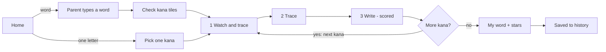

# Hiragana Writing Buddy — Design Doc

Oct 8, 2026 · Liz · Living version: https://claude.ai/code/artifact/3b33fa8f-b34c-41da-b84c-7a6364ce362b

## Overview

Hiragana Writing Buddy is a free, static mobile and tablet web app that teaches a pre-reading child to write their name, or any word up to 14 sounds, in hiragana, one character at a time, in three steps: watch-and-trace, trace, then write on a blank grid. It runs entirely on the device, stores progress locally, and is published as a static site so it costs close to nothing to share with other kindergarten families.

**Audience.** Children aged about 5–6 entering English/Japanese dual-language immersion kindergarten who cannot yet read and have developing fine motor control. A parent types the word; the child does everything else by tapping, listening and drawing.

**Goals**

- Turn an English word or name, or a romaji spelling, into hiragana the child can practise.
- Teach correct stroke order, enforced by the app, with generous tolerance for position and wobble.
- Show ink exactly where the finger touched, instantly, at 40+ fps on mid-tier phones and tablets.
- Ignore palms and resting hands; accept mouse input for testing.
- Build confidence: immediate praise for every good stroke, gentle and never discouraging correction.
- Keep a list of practised words on the device with a score per session, so progress is visible over time.
- Stretch: "hot potato / cold potato" colouring that shows how close each mark is to the model.

**Non-goals for v1.** Katakana and kanji; accounts, servers or cloud sync; ads, purchases or third-party analytics; native app-store builds; vertical (tategaki) practice sheets.

**One cultural note.** In Japanese, foreign names are normally written in katakana, not hiragana. Many immersion kindergartens still start children on their name in hiragana because hiragana is taught first, so this app does that, and katakana is the natural v2 mode.

## User journey

Each character of the word goes through three short phases before the next character starts, and the word ends with the child's own phase-3 drawings shown side by side as "my word". Short loops suit a five-year-old's attention better than running the whole word through phase 1, then phase 2, then phase 3.

1. **Home.** Two big picture buttons: "Write a word" (pencil + speech bubble) and "Practise one letter" (a single あ tile). Below them, a shelf of previously practised words with their best star count.
2. **Enter the word (parent).** A parent types an English word or name, or a romaji spelling. The app shows the result as large kana tiles, speaks each one, and lets the parent fix a tile or switch modes before tapping Start.
3. **Per character, phase 1 — Watch and trace.** The app animates stroke 1, then the child traces it over a highlighted ghost. Then stroke 2 animates, and so on. Each stroke shows its number, a start dot and a direction arrow.
4. **Phase 2 — Trace.** The whole character is shown as a faint ghost with numbered start dots, no animation. The child traces every stroke in order.
5. **Phase 3 — Write.** A blank cell with the standard cross-shaped guidelines and no ghost. The child writes the character from memory, in order. This attempt is scored.
6. **Word complete.** The child's phase-3 drawings appear in a row as "my word", with a celebration, stars and the word spoken aloud. The session is saved to history.
7. **Practise one letter.** A tappable 46-character chart (plus voiced and small kana on a second page) opens the same three phases for a single character, scored and saved the same way.



Both entry paths meet at phase 1; only phase 3 is scored, and the loop repeats once per kana in the word. In every phase a missed stroke fades, the right stroke replays, and the child tries again; order is always enforced.

| Phase | What the child sees | Order enforced | Position tolerance | Scored |
| --- | --- | --- | --- | --- |
| 1 Watch and trace | Animated stroke, then highlighted ghost of that stroke only | Yes | Most lenient | No |
| 2 Trace | Ghost of whole character, numbered start dots | Yes | Lenient | No (stars shown) |
| 3 Write | Empty cell with cross guidelines | Yes | Shape-based, placement judged loosely | Yes |

In every phase, ink appears under the finger immediately, and a stroke that does not match fades away gently while the correct stroke replays. Settings (parent-gated) can skip phase 1 for characters already mastered.

## Word input

The parent picks one of two modes, and both end on an editable row of kana tiles, because no automatic English-to-kana conversion is reliable enough on children's names to skip a human check.

**Mode A — English word or name ("Emma", "dinosaur").** Lookup runs in three tiers, first hit wins:

1. **Curated dictionary** (`data/en-names-words.json`): 176 common US kindergarten names and 44 kid words, written in the usual Japanese katakana spelling and converted to hiragana. Example: James → じぇーむず, Noah → のあ, Michael → まいける. Words also carry the everyday Japanese word, offered as a second choice ("dog" → sound どっぐ, or Japanese いぬ).
2. **e2k character model fallback.** [e2k](https://github.com/Patchethium/e2k) is a small recurrent model that turns English spelling straight into katakana; its code is public-domain (Unlicense), and the weights are trained on Wiktionary and JMdict data. The C2K weights are 4.4 MB as shipped (fp16), so they are lazy-loaded only when a word misses the dictionary, and inference is ported to plain JS. Katakana → hiragana is a fixed code-point shift.
3. **Manual romaji** (Mode B) if the parent prefers.

In a spot test on 48 common names and words, e2k's character model mis-spelled roughly 1 in 4 names (Noah → ノー, Ethan → エタン, Chloe → クロー), and its phoneme model with the CMU dictionary did no better (Isabella → イズベラ, Elizabeth → エリジベスト). Hence the dictionary first and a confirm step always. A Japanese-speaking teacher or parent should review the seed list before launch.

**Mode B — romaji spelling ("rizu", "kyouryuu").** Converted with [WanaKana](https://github.com/WaniKani/WanaKana) (MIT, v5.3.1) `toHiragana`, which handles shi/si, chi/ti, tsu/tu, doubled consonants (っ), ん before vowels via `n'`, and youon (きゃ). A live preview of the tiles updates as the parent types.

**Conventions**

- v-sounds use the b-row (Ava → えいば), never ゔ, which kindergartens do not teach early.
- The long-vowel mark ー is kept, as Japanese picture books and teachers do for names and loanwords, and is practised as a one-stroke glyph. A parent setting expands it to a vowel kana instead (じぇえむず).
- Small kana (ゃ ゅ ょ っ) are practised as their own glyphs, drawn small in the lower-left quarter of the cell.

**The 14-sound limit** counts morae: each kana is one, except that a small ゃ/ゅ/ょ/vowel joins the kana before it, and っ and ー each count as one beat. Christopher (くりすとふぁー) is 6 morae and 7 glyphs. Input over 14 morae shows a friendly "That's a long one! Let's pick part of it" with the first 14 selected.

**Tile editor.** Tapping a tile opens the kana chart to replace it; tiles can be added, removed and reordered by drag. Every tile speaks its sound when tapped, using the browser's Japanese voice (Web Speech API, `ja-JP`), so a parent who cannot read kana can still check the result by ear.

## Stroke data and stroke order

Stroke shapes and order come from [KanjiVG](https://kanjivg.tagaini.net/), already converted into `data/kana-strokes.json` (87 glyphs, 168 KB raw). KanjiVG draws every stroke as a single centre-line path in its correct order and direction, which is exactly what both the animation and the matcher need. All 46 basic kana match the stroke counts taught in Japanese schools (e.g. き 4, さ 3, そ 1, ふ 4, を 3); `reference/kana-preview.png` shows every glyph with numbered, coloured strokes for a visual check.

Each glyph in the JSON holds, per stroke:

- `d` — the original SVG path, used to draw the ghost and to animate the demo (stroke-dashoffset on an SVG path, or the same path sampled onto the canvas).
- `points` — 32 evenly spaced centre-line points in a 0–1 cell, used for matching, hot/cold colouring and the start dot.
- `length` and `numberPos` — stroke length in cell units and where KanjiVG places the stroke number.

**Coverage.** あ–ん, voiced and semi-voiced (が, ぱ …), small kana (ゃ ゅ ょ っ ぁ …) and ー. Small kana are already drawn small and low in the cell. ゐ ゑ ゔ ゕ ゖ are present in the data but hidden from the chart.

**Licence.** KanjiVG is © Ulrich Apel under CC BY-SA 3.0. The app must credit it (an About screen line is enough) and keep the derived stroke JSON under the same licence; the app's own code can stay under any licence.

**Stroke-order engine.** A small state machine per character: `demo(k)` → `await(k)` → `judge` → `accept(k)` or `retry(k)`, advancing k from 1 to the stroke count. Only the expected stroke is ever accepted, which is how order is enforced; a stroke that matches a later stroke is reported as an order slip so the copy can say "Let's do stroke 2 first".

## Stroke matching, feedback and scoring

Each finished stroke is compared only with the stroke that is due next, using five cheap checks on 32 resampled points; the reference implementation (`reference/stroke-matcher.js`) runs in well under a millisecond per stroke and passes its synthetic test suite.

**Checks (all in cell units, 0–1)**

- *Shape:* mean distance between matching points along the two strokes. Because points are paired start-to-end, this also catches a stroke drawn backwards.
- *Start:* distance from the child's first point to the model's start dot.
- *Length:* drawn length (lightly smoothed) between 0.4× and 2× the model's; tiny strokes such as dakuten ticks get up to 3×.
- *Direction:* the start-to-end vector must point roughly the same way (cosine > 0.2), for strokes long enough to have a clear direction.
- *Placement (phase 3 only):* up to 0.18 of the cell of overall offset is forgiven before shape is judged, so a correct shape drawn a little off-centre still counts.

| Phase | Mean-distance tolerance | Start tolerance | Offset forgiven |
| --- | --- | --- | --- |
| 1 Watch and trace | 0.15 | 0.22 | none |
| 2 Trace | 0.13 | 0.20 | none |
| 3 Write | 0.12 | 0.18 | up to 0.18 |

Tolerances shrink in proportion for short strokes, with a 0.07 floor. On synthetic child-like traces across all practice kana (wobble, jitter, ±12% scale, uneven speed), the reference accepts 99.9–100% of correct strokes and rejects 98% of reversed strokes, 87–95% of wrong strokes and 100% of scribbles. These are starting values; tune them in the first playtest with real children.

**Gentle correction ladder**

1. Miss 1: the ink softly fades, a friendly "boop", and the correct stroke replays as a moving dot.
2. Miss 2: the start dot pulses and an arrow shows the direction.
3. Miss 3: "Let's do it together" — the ghost stroke lights up and any stroke that starts near the dot is accepted, then the app moves on.

An order slip (the child drew a later stroke) says "Ooh, that's stroke 3! Let's do stroke 2 first" and highlights stroke 2. There is never a red X, buzzer, sad face or "wrong".

**Positive feedback.** Every accepted stroke gets a chime and a burst of sparkles along the stroke; the ink settles into a smooth "brush" version of itself. A completed character pops, says its sound, and drops a sticker on a progress strip. Praise varies across a pool of short spoken phrases ("じょうず!", "Great job!") so it does not get repetitive.

**Hot potato / cold potato (stretch).** While the finger moves, each new ink point is tinted by its distance to the model stroke: warm orange-gold when on the line, cooling through yellow to soft sky-blue when far off. Red is never used. The tint also changes ink thickness slightly so the cue works for colour-blind children. For speed, precompute a 64×64 distance grid per stroke when a character loads, so each lookup is a single array read.

**Scoring (phase 3).** A character scores 0–100: shape 70% (mean per-stroke quality), placement 15% (character centre vs the model's), proportion 15% (width and height vs the model's), minus 5 points for each stroke that needed a retry. The word score is the mean of its characters. Children only ever see stars: 80+ is 3 stars, 55+ is 2, anything else is 1, so every finished word earns at least one star. Numbers appear only in the parent view. In tests, a neat drawing of あ scored 97 and a wobbly one 74.

## Input handling and palm rejection

All input goes through Pointer Events on one writing canvas, with a single "pen" pointer at a time; everything else on the screen ignores touch. If the `palm.js` module from Soft Canvas fits, port it rather than starting over, and add the rules below.

**Setup**

- `touch-action: none` and `user-select: none` on the writing area; `overscroll-behavior: none` on the page; no pinch-zoom or double-tap zoom (viewport meta plus CSS).
- On `pointerdown` inside the cell, call `setPointerCapture` so a stroke that leaves the cell still ends cleanly.
- Read `getCoalescedEvents()` on each `pointermove` when available for smooth, dense strokes; it is in Chrome and, since 2024, in Safari on iOS and macOS. Fall back to the event itself.
- Mouse (`pointerType: "mouse"`) works with the same code path, for desktop testing. A stylus (`"pen"`) is preferred: once a pen is seen, ignore touch for the rest of the session, as drawing apps do.

**Palm and stray-touch rules**

1. **Only the cell counts.** A touch that starts outside the writing square is ignored, so hands resting on the sides, bottom bezel or toolbar do nothing. The cell has a 12 px forgiving margin.
2. **One pen at a time.** While a stroke is active, other pointers are ignored entirely. A pointer that went down within 150 ms of another and is larger or further from the cell centre is treated as the palm; the other becomes the pen.
3. **Contact size.** Where the browser reports `width`/`height`, a contact over about 40 CSS px across is a palm.
4. **Accidental taps.** A stroke shorter than 2% of the cell that lasts under 80 ms is dropped silently. The thresholds stay small so dakuten ticks still count.
5. **Palm-then-pen.** If a palm-sized contact lands mid-stroke, keep the current stroke and ignore the contact; never cancel a child's stroke because a hand touched down.
6. **`pointercancel`** (system gesture, incoming call) discards the current stroke without counting it as a miss.

**Instant ink.** The stroke is drawn on the very next frame from the raw points. Matching runs only on `pointerup`, so a child always sees exactly where they touched, including in phase 3.

## Rendering and performance

Target 60 fps with 40 fps as the hard floor on a mid-tier phone and tablet, which plain Canvas 2D with three stacked layers comfortably meets: the per-frame work while drawing is a few line segments.

| Layer | Contents | Redrawn when |
| --- | --- | --- |
| Guide (bottom) | Cell border, cross guidelines, ghost strokes, start dots, numbers | Character or phase changes |
| Ink (middle) | The child's strokes | Incrementally: only new segments each frame |
| Effects (top) | Demo animation, sparkles, hot/cold tint, fades | Only while an effect is running |

**Rules**

- `requestAnimationFrame` runs only while something moves; an idle screen draws nothing.
- Canvas backing size = CSS size × `devicePixelRatio`, capped at 2, so a 3× phone does not push 2.25× the pixels for no visible gain.
- No layout reads (`getBoundingClientRect`) inside pointer handlers; cache the cell rect on resize.
- Sparkles use a fixed-size particle pool (64 max); no allocations per frame.
- Ink uses round caps and joins with quadratic smoothing between coalesced points; finished strokes are not re-rendered.
- PixiJS is an option for richer celebration effects, given it is already in the Soft Canvas stack, but it is not needed for v1 and adds about 100 KB+ to the bundle.

**Budgets**

- JS + CSS for first load: under 150 KB gzipped, plus stroke data (load once, cache) and the e2k model (lazy, only on dictionary miss).
- Time to first drawable screen: under 2 s on a mid-tier phone over 4G.
- Pointer-to-ink latency: one frame.
- Test devices: one mid-tier Android phone (e.g. a recent Galaxy A-series), one base-model iPad, one older iPhone. Use the browser's performance panel with CPU throttling 4× as the desktop proxy.

## UI design for pre-readers

A child who cannot read must be able to use every screen after word entry by sight and sound alone, so every control is a picture with a spoken label and nothing important is text-only.

- **One job per screen.** The writing screen shows the cell, a row of progress dots (one per kana in the word), a replay button (circular arrow) and a home button. Nothing else.
- **The cell** fills the space: about min(85% of width, 65% of height), centred, with the cross-shaped dashed guidelines used on Japanese practice sheets. Landscape tablets put the word strip to the left.
- **Big targets.** Buttons are at least 64 px, spaced 16 px apart, and kept away from the cell edges so a resting hand cannot hit them. Parent-only controls (settings, history numbers, delete) sit behind a press-and-hold gate.
- **Sound.** Each kana is spoken when its phase starts and when it is completed; prompts are short spoken lines, with a mute button for classrooms. Speech uses the browser's Japanese and English voices; recorded clips can replace them later.
- **Look.** Soft, warm palette on an off-white background, rounded shapes, one friendly mascot that demos strokes and cheers. Model strokes in a calm dark ink; the child's ink in a cheerful colour they can pick on the home screen.
- **Motion.** Stroke demos at a child's writing speed (about 0.6–1.2 s per stroke, scaled by length), with a pause between strokes. Celebrations last under 2 s so they never block the next try. Respect `prefers-reduced-motion`.
- **Accessibility.** Hot/cold cue uses thickness as well as colour; contrast of model strokes and guidelines at least 3:1; the app works in both orientations and never needs scrolling while writing.
- **No dark patterns.** No timers, no lives, no streak-loss pressure, no ads, no purchases, no external links outside the parent gate.

## Practice history and scores

History lives only on the device, in IndexedDB, with no accounts and nothing sent anywhere; the main risk to it is Safari's storage clean-up, which the app counters by encouraging "Add to Home Screen" and offering a backup file.

**Data model**

```json
{
  "profiles": [{ "id": "p1", "name": "Emma", "inkColor": "#F28C28", "createdAt": "2026-10-08T19:40:00Z" }],
  "items": [{
    "id": "w_8f2c", "profileId": "p1", "kind": "word",
    "input": "Emma", "mode": "english", "kana": ["え", "ま"],
    "createdAt": "2026-10-08T19:41:00Z", "lastPracticedAt": "2026-10-08T19:48:00Z",
    "sessions": [{
      "at": "2026-10-08T19:48:00Z", "score": 82, "stars": 3,
      "perKana": [{ "kana": "え", "score": 78, "retries": 1 }, { "kana": "ま", "score": 86, "retries": 0 }],
      "drawing": [[[[0.31, 0.22], [0.36, 0.23]]]]
    }]
  }],
  "settings": { "expandLongVowel": false, "skipPhase1WhenMastered": true, "sound": true }
}
```

- `kind` is `"word"` or `"kana"` (single-letter practice). `drawing` keeps the phase-3 strokes, downsampled to 16 points per stroke, so "my word" can be redrawn in history; cap stored sessions at 20 per item.
- Optional profiles let siblings share a tablet; default is one unnamed profile.

**History screen.** A shelf of word cards, newest first, each showing the kana, the child's last drawing and best stars; tap to practise again. The parent view adds a small score line per word over time and a per-kana list of the weakest characters to revisit.

**Keeping data safe**

- WebKit deletes all script-writable storage (IndexedDB, localStorage, service-worker caches) for a site after [seven days of Safari use without interaction with it](https://searchengineland.com/what-safaris-7-day-cap-on-script-writeable-storage-means-for-pwa-developers-332519). Web apps added to the Home Screen keep their own counter that only advances when the app itself is used, so in practice they keep their data.
- So: ship as an installable PWA (manifest + service worker) and show iOS families a one-time, picture-led "Add to Home Screen" tip.
- Call `navigator.storage.persist()` on first save.
- Parent menu: "Save a backup" downloads a JSON file; "Restore" reads one back.

## Tech stack, hosting and cost

The app is a static site, so hosting is free: build with Vite and publish to GitHub Pages from the repo with a GitHub Actions workflow, with Cloudflare Pages as the alternative; the only optional cost is a custom domain.

| Piece | Choice | Why |
| --- | --- | --- |
| Language and build | TypeScript + [Vite](https://vite.dev/) | Fast dev server, tiny static output, easy for Claude Code |
| Screens | Preact (about 4 KB) or plain DOM | Only five screens; no heavy framework needed |
| Drawing | Canvas 2D, three layers | Meets the frame budget with the least code |
| Kana conversion | [WanaKana](https://github.com/WaniKani/WanaKana) (MIT) + curated dictionary + [e2k](https://github.com/Patchethium/e2k) C2K fallback | See Word input |
| Stroke data | KanjiVG-derived JSON from the resource pack | CC BY-SA 3.0, credit in About |
| Storage | IndexedDB via a small wrapper (e.g. `idb-keyval`) | Survives reloads; JSON backup |
| Offline and install | Web app manifest + service worker (`vite-plugin-pwa`) | Home-screen install protects data on iOS |
| Speech | Web Speech API (`speechSynthesis`, ja-JP and en-US) | Free, built in; recorded clips later |
| Tests | Vitest for logic, Playwright for touch/mouse flows on phone and tablet viewports | Synthetic stroke tests from the pack run in CI |

**Hosting options**

- **GitHub Pages** — free for a public repository; the repo you already use for Soft Canvas shows the workflow. URL like `lizspain.github.io/hiragana-buddy`.
- **Cloudflare Pages** — free plan allows [500 builds a month and up to 20,000 files of 25 MiB each](https://developers.cloudflare.com/pages/platform/limits), far beyond this app's needs, with a global CDN.
- **Custom domain** — optional, roughly the cost of a yearly domain registration; makes the flyer link shorter.

**Sharing with other families.** A one-page flyer with a QR code to the URL and a picture of "Add to Home Screen". Because nothing is collected or sent, there is no sign-up, no consent form and no privacy policy beyond a one-line "Everything stays on this device" note in the parent menu. Avoid adding analytics or crash reporting; that is what would bring in children's-privacy obligations.

## Resource pack, milestones and acceptance

This repo's root `CLAUDE.md` condenses this doc into rules, milestones and checks for Claude Code.

| File | Contents |
| --- | --- |
| `CLAUDE.md` | Agent brief: non-negotiables, stack, flow, matcher numbers, input rules, storage, milestones, acceptance checks |
| `docs/DESIGN.md` | This design doc |
| `data/kana-strokes.json` | 87 glyphs of KanjiVG stroke data: SVG paths + 32-point centre lines (CC BY-SA 3.0) |
| `data/kana-table.json` | Chart layout (basic, voiced, small, ー), romaji, text to speak |
| `data/en-names-words.json` | 176 names and 44 words → hiragana, with mora counts and Japanese words |
| `reference/stroke-matcher.js` | Tested matcher, order-slip detection, hot/cold warmth, character score |
| `tests/matcher.test.mjs` | Synthetic child-trace tests (`node --test tests/matcher.test.mjs`, 5 pass) |
| `reference/kana-preview.png` | Stroke-order contact sheet of every glyph |
| `scripts/` | Python scripts that rebuild all three data files |
| `data/ATTRIBUTION.md` | Licences and the About-screen credit line |

**Milestones** (each ends with a deploy to Pages so it can be tried on a real tablet)

1. Skeleton: Vite, PWA, Pages workflow; home, kana chart, writing screen with guides; touch and mouse ink.
2. Engine: matcher ported to TypeScript with its tests; three phases for one kana; correction ladder; praise; palm rules.
3. Words: romaji and dictionary input, tile editor, 14-mora limit, word flow, "my word" screen, speech.
4. History: IndexedDB, history shelf, parent score view, backup; e2k fallback.
5. Polish: hot/cold potato, mascot, reduced motion, performance pass on devices, first playtest and tolerance tuning.

**Acceptance checks**

- [ ] Matcher tests pass after the TypeScript port, thresholds unchanged unless agreed.
- [ ] Drawing あ correctly with a mouse through all three phases gives 3 stars.
- [ ] Drawing stroke 2 first shows the order message and no failure state.
- [ ] A large second touch at the cell edge during a stroke leaves one clean stroke.
- [ ] 40+ fps sustained while drawing with 4× CPU throttling, and on the test devices.
- [ ] First load under 150 KB gzipped JS + CSS.
- [ ] After one visit, the app opens and saves history in airplane mode.
- [ ] No network requests except the site's own static files.
- [ ] A child can complete every screen after word entry without reading.

**Open questions**

- Should names default to hiragana only, or also offer katakana (the usual script for non-Japanese names) as a later mode?
- Who reviews the 176-name seed list: a teacher at the immersion program or a Japanese-speaking parent?
- Is the browser's Japanese voice good enough on the families' devices, or should kana sounds be recorded?
- Does the school use horizontal or vertical practice sheets? This app assumes horizontal.

## Sources

- [KanjiVG](https://kanjivg.tagaini.net/) — stroke data and licence
- [WanaKana](https://github.com/WaniKani/WanaKana) — romaji conversion
- [e2k](https://github.com/Patchethium/e2k) — English-to-katakana models and licences
- [Safari's 7-day storage cap and home-screen apps](https://searchengineland.com/what-safaris-7-day-cap-on-script-writeable-storage-means-for-pwa-developers-332519)
- [WebKit: getCoalescedEvents on iOS](https://lists.webkit.org/pipermail/webkit-changes/2024-July/304701.html)
- [Cloudflare Pages limits](https://developers.cloudflare.com/pages/platform/limits)
